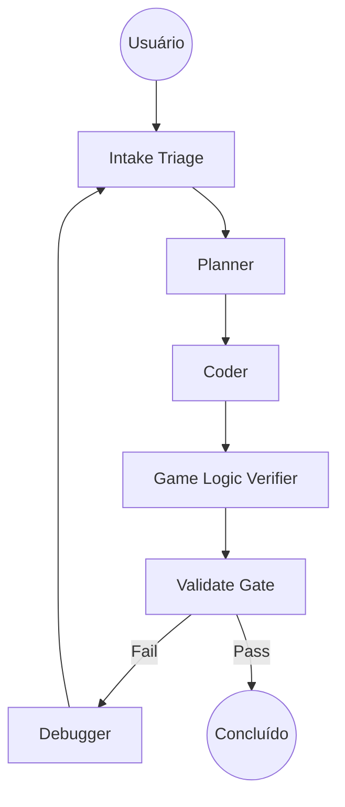

# 🤖 AGENTS.md — Coordenação de Agentes IA (Reinos Medievais)

> **Sistema de Documentação Integrado**
> Este documento orquestra as fontes de verdade do projeto:
>
> - `MAESTRO.md` — O núcleo de regras sempre ativo e governança de workflows (Kernel de Comportamento).
> - `types.ts` — A especificação técnica dos dados do jogo (Províncias, Reinos, Tropas).
> - `IMPLEMENTACOES-FUTURAS.md` — O roadmap de funcionalidades e correções.

---

## 🎭 Perfis de Agentes

### 🎯 Planner (Estrategista de Jogo)

- Analisa mecânicas de jogo (economia, combate, IA).
- Cria planos focados em estabilidade e balanço.
- Considera edge cases de estado (turno travado, recursos negativos).
- **Referências:** `INTAKE TRIAGE` | `BUILD FLOW`.
- **Guidelines:** Think Before Coding (§1 do MAESTRO). Defina sucesso antes de agir.

### 💻 Coder (Arquiteto de Estado)

- Implementa lógica pura e componentes UI premium.
- Especialista em React 19, Tailwind v4 e manipulação imutável de estado.
- Garante que a lógica esteja isolada em `src/logic/`.
- **Referências:** `BUGFIX FLOW` | `BUILD FLOW` | `REFACTOR FLOW`.
- **Guidelines:** Simplicity First. Surgical Changes. Match existing style.

### 🔍 Reviewer (Guardião da Lógica)

- Valida se a implementação segue o `MAESTRO.md`.
- Foca em detectar mutações de estado e furos na economia.
- Exige `lint` e `build` limpos.
- **Referências:** `GAME LOGIC VERIFIER` | `VALIDATE GATE`.
- **Checklist:** Código limpo, seguro, testado e tipado.

### 🔧 Debugger (Mestre das Correções)

- Especialista em rastrear bugs de referência no `gameState`.
- Atua em erros de UI e regressões de mecânica.
- **Entrega:** Reprodução do bug, correção cirúrgica e teste de não-regressão.
- **Referências:** `BUGFIX FLOW` | `DEBUG TRACE`.

---

## 🔄 Fluxo de Trabalho

---

## 🧠 Kernel de Comportamento (MAESTRO.md)

- Toda ação deve respeitar as **12 Regras de Kernel** do `MAESTRO.md`.
- Prioridade 1: **Integridade do Estado**. Se não for imutável, está errado.
- Prioridade 2: **Separação de Camadas**. Lógica pura não conhece o React.
- **Goal-Driven Execution:** Transforme tarefas em metas verificáveis.

---

## 🏰 Domínio Reinos Medievais — Conceitos Críticos

**Estruturas de Dados (src/types.ts):**

- `GameState` — O átomo central do jogo.
- `Province` — Dados geográficos e de posse.
- `Kingdom` — Recursos, exército e política.
- `TroopComposition` — O equilíbrio entre Infantaria, Cavalaria e Arqueiros.

**Sistemas Críticos:**

- **Economia:** Renda = (Províncias * Taxa) - Manutenção de Tropas.
- **Combate:** Cálculo baseado em força relativa e bônus de terreno.
- **IA:** Decisões baseadas em expansão territorial e defesa de capital.

---

## ✅ Checklist Pré-Tarefa (Obrigatório)

- [ ] **Triage:** O risco foi avaliado? (Trivial, Standard, Risky, Structural).
- [ ] **State Check:** A mudança toca em objetos aninhados do `gameState`? (Se sim, use Deep Clone).
- [ ] **Logic Check:** A nova regra está em `src/logic/`?
- [ ] **Linting:** `npm run lint` passa sem erros?
- [ ] **Build:** `npm run build` sucede sem avisos críticos?

---

### *AGENTS.md | Reinos Medievais | Versão 1.1*
